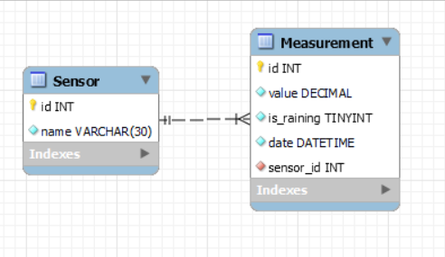

# Weather-sensor-api  
## Задача  
Создать REST API сервис, который будет принимать данные от
"сенсора"  
Сенсор имеет доступ в интернет, поэтому может отправлять HTTP запросы к
нашему серверу  
Каждый раз, когда он будет производить измерение, он будет слать HTTP
запрос с данными в формате JSON на наш сервер - для этого в реальной жизни
мы бы указали устройству IP адрес того компьютера, где мы запускаем Spring
REST API приложение. После этого, на нашем компьютере мы сможем
принимать запросы от сенсора  

### Ход работы  
* Создание REST API приложения с помощью Spring REST  
* Создание Java клиента, который бы отправлял данные на
  REST API приложение - с помощью класса RestTemplate  

### Описание end-point  
Описывается адрес API, данные которые передаются при запросе на
этот адрес и тот функционал, который должен предоставляться в
результате запроса на этот адрес  
* POST /sensors/registration  
* DTO: {"name": "ваше имя"}
Регистрирует новый сенсор в системе.
Валидирует тот факт, что сенсора с таким названием еще нет в БД.
Если сенсор с таким названием есть в БД - возвращать
клиенту сообщение с ошибкой.
Также, если название сенсора пустое или содержит менее 3 или более 30 символов,
клиенту должно возвращаться сообщение с ошибкой  
* POST /measurements/add  
* DTO: {"value": 24.7, "raining": false, "sensor": {"name": "ваше имя"}}  
  Добавляет новое измерение. Это тот адрес, куда настоящий сенсор посылал бы свои данные.
  Вещественное поле "value" содержит значение температуры воздуха, булево поле "raining" содержит
  значение true/false в зависимости от того, зарегистрировал ли сенсор дождь или нет. Помимо этого, в
  этом запросе передается сам объект сенсора, который получил и отправляет эти "измерения".
  Значения температуры воздуха, дождя должны сохранятся в таблице в БД. Также, в каждой строке этой
  таблицы должно содержаться название того сенсора, который прислал эти измерения. То есть
  сущность "Measurements" имеет связь с сущностью "Sensor".
  Все поля у измерения должны валидироваться.
  Значение "value" должно быть не пустым и находиться в диапазоне от -100 до 100.
  Значение "raining" должно быть не пустым.
  Значение "sensor" должно быть не пустым. При этом, название сенсора должно валидироваться в БД.
  Сенсор с таким названием должен быть зарегистрирован в системе (должен быть в БД).
  Если такого сенсора нет в БД - выдавать ошибку. Также, не забывайте про DTO.
  На сервере, у измерения должно выставляться текущее время, оно должно сохраняться в БД  
* GET /measurements  
Возвращает все измерения из БД  
* GET /measurements/rainyDaysCount  
Возвращает количество дождивых дней из БД  

### Задание REST Template клиента
* POST /measurements/add  
Отправить 1000 запросов со случайными температурами и "дождями"  

### Бонус  
Построить график температур, получив 1000 температур с сервера через xchart  

### Схема БД  
  
